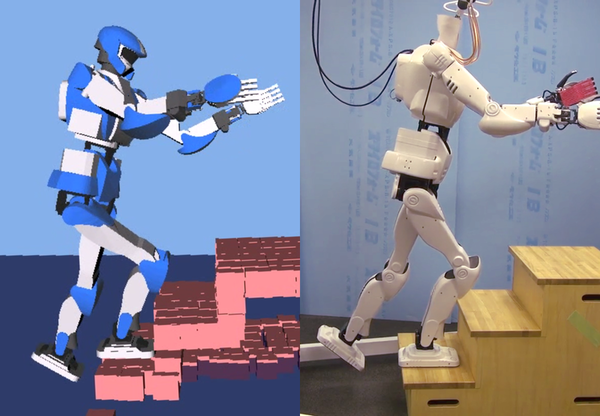

# pymanoid

Python library for humanoid robotics based on
[OpenRAVE](https://github.com/rdiankov/openrave):

- Whole-body inverse kinematics (IK) based on the [weight-prioritized
  multi-task framework](https://scaron.info/teaching/inverse-kinematics.html)
- Contact-stability areas and volumes: [multi-contact ZMP
  support areas](https://scaron.info/research/tro-2016.html), [CoM acceleration
  cones](https://scaron.info/research/humanoids-2016.html), etc.
- Linear Model Predictive Control (MPC) and state machines for locomotion
- Jacobians and Hessians for center of mass (CoM) and angular momentum
- Types and algorithms to manipulate polytopes and polyhedral cones
- Interface to linear programming (LP) and quadratic programming (QP) solvers

## Use cases



- [Dynamic walking over rough terrains](https://github.com/stephane-caron/dynamic-walking)
  based on nonlinear model predictive control of the floating-base inverted
  pendulum model
- [Multi-contact walking pattern generation](https://github.com/stephane-caron/3d-walking-lmpc)
  based on linear model predictive control of 3D CoM accelerations
- [Multi-contact ZMP support areas](https://github.com/stephane-caron/multi-contact-zmp)
  for locomotion in multi-contact scenarios (including hand contacts)
- [Humanoid stair climbing](https://github.com/stephane-caron/stair-climbing)
  demonstrated on a Kawada HRP-4 robot

## Getting started

- [Installation instructions](#installation)
- [Documentation](https://scaron.info/doc/pymanoid/)
- [FAQ](https://github.com/stephane-caron/pymanoid/wiki/Frequently-Asked-Questions)
- [Examples](/examples)

## Installation

First, you will need to install
[OpenRAVE](https://github.com/rdiankov/openrave). Here are some [instructions
for Ubuntu
14.04](https://scaron.info/teaching/installing-openrave-on-ubuntu-14.04.html)
and [Ubuntu
16.04](https://scaron.info/teaching/installing-openrave-on-ubuntu-16.04.html).

Next, install all Python dependencies with:
```
sudo apt-get install cython libglpk-dev python python-dev python-pip python-scipy python-simplejson
sudo pip install quadprog pycddlib
sudo CVXOPT_BUILD_GLPK=1 pip install cvxopt
```
Finally, clone the repository, and run the setup script:
```
git clone https://github.com/stephane-caron/pymanoid.git && cd pymanoid
python setup.py build
python setup.py install --user
```

### Optional

For nonlinear optimal control, you will need to [install
CasADi](https://github.com/casadi/casadi/wiki/InstallationLinux), preferably
from source to install the MA27 linear solver as well.

Some minor functions to manipulate polygons may also require two small
libraries: ``sudo pip install pyclipper``.
