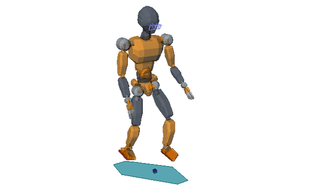

# Examples

## Control

### Inverse Kinematics

This example shows how to use the robot IK to generate whole-body motions.

It loads (and downloads, if necessary) the
[JVRC-1](https://github.com/stephane-caron/openrave_models/tree/master/JVRC-1) humanoid model, then generates a posture where the robot has both feet on pre-defined contact locations. Next, it tracks a reference COM motion given by the green virtual box. The box is moved around for a while, then you can manipulate it directly in the OpenRAVE GUI.

### Multi-contact Walking

In this example, we make the JVRC-1 model walk accross a circular staircase where all contacts are tilted.

The environment is generated so as to make the locomotion task difficult. We solve it using a [multi-contact linear
MPC](https://scaron.info/research/humanoids-2016.html) where the formulation is kept linear thanks to the pendular COM acceleration cone (see the other example below).

## Contact-stability

Contact-stability areas and volumes are conditions used to prevent contacts
from slipping or detaching during motion.

### Static-equilibrium Polygon

In this example, we display the static-equilibrium COM polygon (in magenta) for
a given set of contacts.
    
The definition and calculation of this polygon is detailed in [this
paper](https://doi.org/10.1109/TRO.2008.2001360). You can move contacts by
selecting them in the OpenRAVE GUI. The robot IK is servoed to their positions.
To illustrate the validity of this polygon, contact forces are computed that
support the equilibrium position represented by the blue box (which acts like a
COM position). Try moving this box around, and see what happens when it exits
the polygon.

### ZMP Support Area

In this example, we display the pendular ZMP support area of the robot in a
double-support configuration with titled contacts.

The definition and calculation of these support areas is detailed in [this
paper](https://scaron.info/research/tro-2016.html). They depend both on contact
locations and on the position of the center of mass, so when you move it or its
projection (blue box) you will see the area change as well.

### COM Acceleration Cone

In this example, we display the pendular COM acceleration cone of the robot in
a double-support configuration with titled contacts.

The definition and calculation of this cone is detailed in [this
paper](https://scaron.info/research/humanoids-2016.html). It depends both on
contact locations and on the position of the center of mass, so when you move
it or its projection (blue box) you will see its shape change as well.
