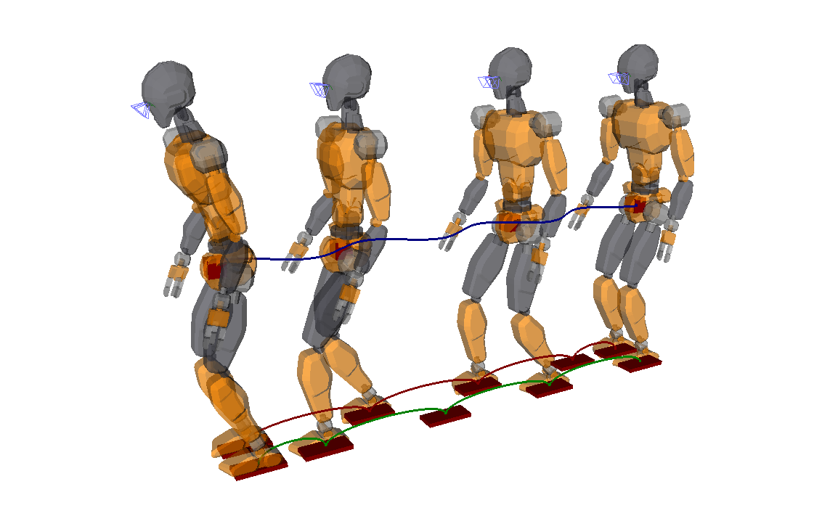

# Examples

## Inverse kinematics

The [inverse\_kinematics.py](inverse_kinematics.py) script shows how to use the
inverse kinematics to achieve a given posture. It contains two equivalent
implementations of the IK solver setup. The former is best for beginners as it
uses the simpler ``Stance`` interface. The latter is for more advanced users
and shows how to add individual tasks one by one.

The example loads (and downloads, if necessary) the
[JVRC-1](https://github.com/stephane-caron/openrave_models/tree/master/JVRC-1)
humanoid model, then generates a posture where the robot has both feet on
pre-defined contact locations. The robot tracks a reference COM position given
by the red box, which you can move around directly by using the interaction
mode of the OpenRAVE GUI.

## Contact stability conditions

Contact-stability areas and volumes are conditions used to prevent contacts
from slipping or detaching during motion. The examples in the
[contact\_stability](contact_stability/) folder illustrate these conditions:
static-equilibrium COM polygon, multi-contact ZMP support areas, etc.

In these examples, you can move contacts by selecting them in the OpenRAVE GUI.
Contact wrenches are computed at each contact to support the robot in
static-equilibrium. Try moving the blue box (in the plane above the robot)
around, and see what happens when it exits the polygon.

## Horizontal walking

In this example, we make the JVRC-1 model walk forward on a flat horizontal
floor. The COM trajectory is generated on the fly by [linear model predictive
control](https://scaron.info/doc/pymanoid/walking-pattern-generation.html#pymanoid.mpc.LinearPredictiveControl).

This examples illustrates the tutorial [Prototyping a walking pattern
generator](https://scaron.info/teaching/prototyping-a-walking-pattern-generator.html).
The concepts it introduces are the same as those implemented in a [full-fledged
walking controller](https://github.com/stephane-caron/lipm_walking_controller/)
applied for walking and stair climbing with the HRP-4 humanoid.

## Multi-contact walking

In this example, we make the JVRC-1 model walk accross a circular staircase
where all contacts are tilted.

The environment is generated so as to make the locomotion task difficult. We
solve it using a [multi-contact linear
MPC](https://scaron.info/research/humanoids-2016.html) where the formulation is
kept linear thanks to the pendular COM acceleration cone.
