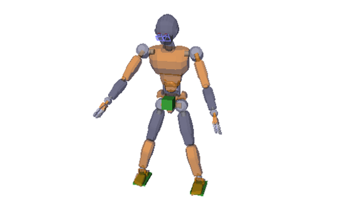
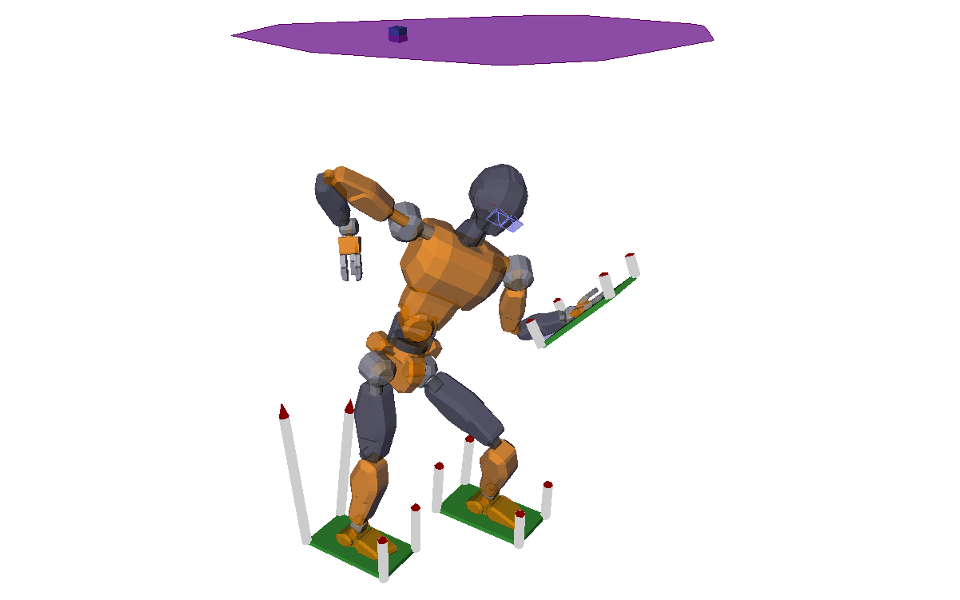

# Examples

## Posture generation

The examples ``posture_generation.py`` and ``inverse_kinematics.py`` (the
latter is for advanced users) shows how to use the robot IK to reach a given
posture.

It loads (and downloads, if necessary) the
[JVRC-1](https://github.com/stephane-caron/openrave_models/tree/master/JVRC-1)
humanoid model, then generates a posture where the robot has both feet on
pre-defined contact locations. Next, it tracks a reference COM motion given by
the green virtual box. The box is moved around for a while, then you can
manipulate it directly in the OpenRAVE GUI.

## Contact stability

Contact-stability areas and volumes are conditions used to prevent contacts
from slipping or detaching during motion. The examples in the
[contact\_stability](contact_stability/) folder illustrate these conditions:
static-equilibrium COM polygon, multi-contact ZMP support areas, etc.

In these examples, you can move contacts by selecting them in the OpenRAVE GUI.
Contact wrenches are computed at each contact to support the robot in
static-equilibrium. Try moving the blue box (in the plane above the robot)
around, and see what happens when it exits the polygon.

## Multi-contact walking

In this example, we make the JVRC-1 model walk accross a circular staircase
where all contacts are tilted.

The environment is generated so as to make the locomotion task difficult. We
solve it using a [multi-contact linear
MPC](https://scaron.info/research/humanoids-2016.html) where the formulation is
kept linear thanks to the pendular COM acceleration cone (see the other example
below).
